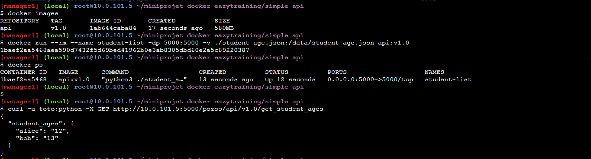
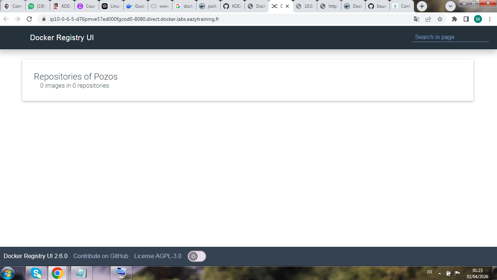

# 🐳 Miniprojet Docker — EazyTraining

> Déploiement d'une API Python conteneurisée avec Docker, exposée via un registre privé Docker Registry UI.

---

## 📋 Description

 Ce projet consiste à :

1. **Construire une image Docker** d'une API Python simple (`api:v1.0`) qui expose des données sur les âges des étudiants.
2. **Exécuter l'API dans un conteneur Docker** avec un volume monté pour les données.
3. **Déployer un Docker Registry privé** avec une interface graphique (Docker Registry UI) pour gérer les images.

---

## 🏗️ Architecture

```
.
├── simple api/
│   ├── Dockerfile
│   ├── student_age.json       # Fichier de données monté en volume
│   └── student_api.py         # Script Python de l'API
└── README.md
```

---

## 🚀 Prérequis

- Docker installé sur la machine hôte
- Accès à un terminal Linux (testé sur un nœud manager Swarm : `manager1` / `10.0.101.5`)

---

## 🛠️ Étapes de déploiement

### 1. Construction de l'image Docker

Depuis le répertoire `simple api/` :

```bash
docker build -t api:v1.0 .
```

Vérification de l'image créée :

```bash
docker images
```

Résultat attendu :

```
REPOSITORY   TAG    IMAGE ID       CREATED             SIZE
api          v1.0   1ab644caba84   17 seconds ago      580MB
```

---

### 2. Lancement du conteneur

L'API est lancée avec :
- Le port `5000` exposé sur l'hôte
- Le fichier `student_age.json` monté en volume dans le conteneur

```bash
docker run --rm --name student-list \
  -dp 5000:5000 \
  -v ./student_age.json:/data/student_age.json \
  api:v1.0
```

Vérification du conteneur actif :

```bash
docker ps
```

Résultat attendu :

```
CONTAINER ID   IMAGE      COMMAND               CREATED          STATUS         PORTS                    NAMES
1baef2aa5468   api:v1.0   "python3 ./student…"  13 seconds ago   Up 12 seconds  0.0.0.0:5000->5000/tcp   student-list
```

---

### 3. Test de l'API

L'API est protégée par une authentification basique (`toto:python`). On peut la tester avec `curl` :

```bash
curl -u toto:python -X GET http://10.0.101.5:5000/pozos/api/v1.0/get_student_ages
```

Réponse attendue :

```json
{
  "student_ages": {
    "alice": "12",
    "bob": "13"
  }
}
```

📸 **Capture d'écran — Build, run et test de l'API :**



> On voit successivement : la liste des images (`docker images`), le lancement du conteneur (`docker run`), la vérification avec `docker ps`, et enfin l'appel `curl` qui retourne bien les données JSON des étudiants alice et bob.

---

### 4. Docker Registry UI

Un registre Docker privé avec interface graphique a été déployé et est accessible via le navigateur :

```
http://ip10-0-6-5-d76pmve57ed000fgcod0-8080.direct.docker.labs.eazytraining.fr
```

> **Version :** Docker Registry UI `2.6.0`  
> **Licence :** AGPL-3.0

📸 **Capture d'écran — Docker Registry UI (registre vide au démarrage) :**



> Au démarrage, le registre est vide : **0 images dans 0 repositories**. Les prochaines étapes consistent à taguer et pousser l'image `api:v1.0` vers ce registre privé.

---

## 📦 Pousser l'image vers le registre privé

Une fois le registre opérationnel, publier l'image :

```bash
# Taguer l'image avec l'adresse du registre
docker tag api:v1.0 <REGISTRY_URL>/api:v1.0

# Pousser l'image
docker push <REGISTRY_URL>/api:v1.0
```

Remplacez `<REGISTRY_URL>` par l'adresse de votre registre privé.

---

## 📁 Fichier de données

Le fichier `student_age.json` contient les données des étudiants. Exemple :

```json
{
  "student_ages": {
    "alice": "12",
    "bob": "13"
  }
}
```

Ce fichier est injecté dans le conteneur via un volume Docker, ce qui permet de le modifier sans reconstruire l'image.

---

## 🔐 Authentification API

| Utilisateur | Mot de passe |
|-------------|--------------|
| `toto`      | `python`     |

---

## 👤 Auteur

**KODJI Kanka**  
Formation DevOps — [EazyTraining](https://eazytraining.fr)  
GitHub : [KODJIKanka](https://github.com/KODJIKanka)

---

## 📄 Licence

Ce projet est réalisé dans le cadre d'une formation DevOps avec EazyTraining.
